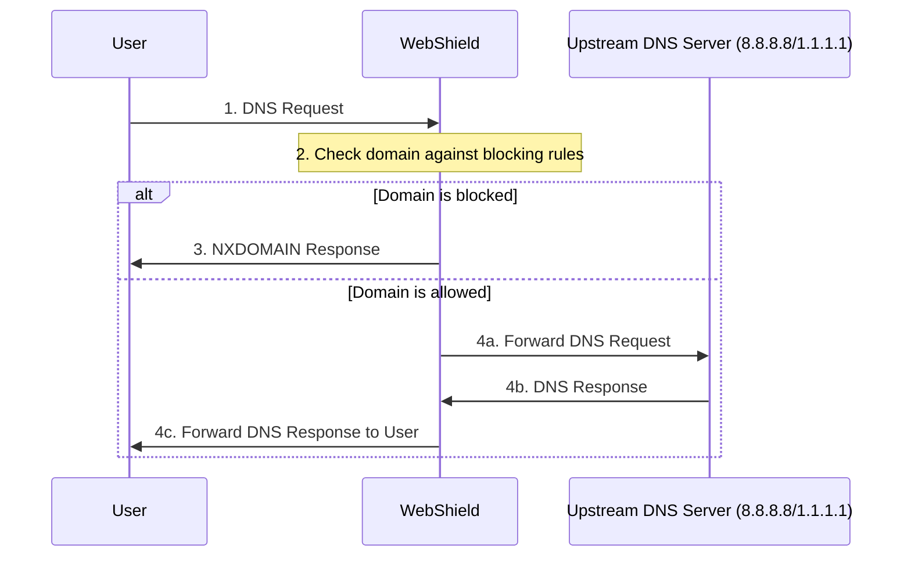
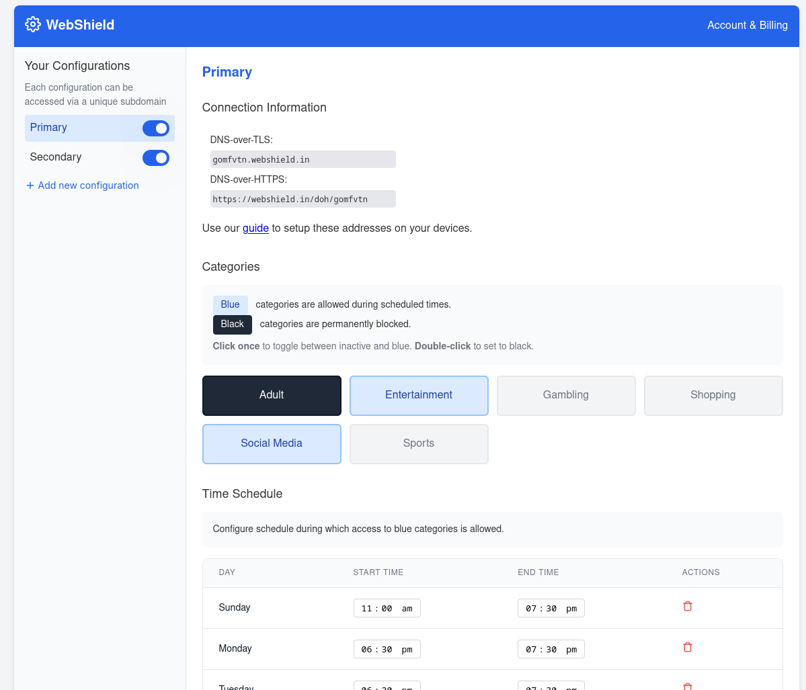

# WebShield
A DNS based web filtering service that allows users to block websites and apps by categories. It can block services permanently or allow temporary access as per user configuration. The objective behind this project is to allow users to reclaim their valuable time and focus on things that matter.

## How it works?
WebShield provides user with the 2 endpoints to choose from, these are:

1. DNS over TLS (for Android)
2. DNS over HTTPS (for browsers and major operating systems)

User needs to configure one or both the endpoints on their devices. Once configured all the DNS requests are routed via WebShield server where it's validated as per rules configured by the user which effectively enables blocking on their devices.

Following sequence diagram shows how DNS requests are processed on WebShield's server


Currently no caching of DNS results is implemented. There are mainly 2 reasons for this:
1. DNS caching is very tricky to implement. It increases the complexity significantly.
2. No degradation of service due to lack of caching for few users.

### Installation

1. Clone the repository using `git clone git@github.com:quaintdev/webshield.git`. 
1. Create `blocklists` directory. This directory will hold categories of domains as shown below. The txt files will hold one domain name per line
1. If you want DNS over TLS support you will have to provide TLS certs via `config.json`
1. Configure environment variables within `start.sh` as per your requirements. If you want DNS over TLS support then you will have to use `sudo` to run the script otherwise it's not required.
1. You can use Caddy or any other reverse proxy in front of this server for DNS over HTTPS support. 

```
├── blocklists
│   ├── adult.txt
│   ├── ai.txt
│   ├── dating.txt
│   ├── entertainment.txt
│   ├── gambling.txt
│   ├── malware.txt
│   ├── news.txt
│   ├── shopping.txt
│   ├── social_media.txt
│   ├── sports.txt
│   └── streaming.txt
├── config.json
├── start.sh
├── static
   ├── guide.html
   ├── home.html
   └── styles
       └── home.css
```
### Screenshot of Webshield Panel




